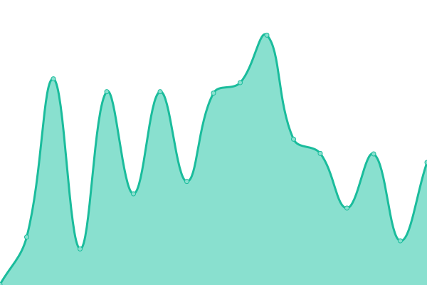

# [📈 Live Status](https://demo.upptime.js.org): <!--live status--> **🟧 Partial outage**

This repository contains the open-source uptime monitor and status page for [Upptime](https://upptime.js.org), powered by [Upptime](https://github.com/upptime/upptime).

With [Upptime](https://upptime.js.org), you can get your own unlimited and free uptime monitor and status page, powered entirely by a GitHub repository. We use [Issues](https://github.com/upptime/upptime/issues) as incident reports, [Actions](https://github.com/txyyddss/upptime/actions) as uptime monitors, and [Pages](https://demo.upptime.js.org) for the status page.

<!--start: status pages-->
<!-- This summary is generated by Upptime (https://github.com/upptime/upptime) -->
<!-- Do not edit this manually, your changes will be overwritten -->
<!-- prettier-ignore -->
| URL | Status | History | Response Time | Uptime |
| --- | ------ | ------- | ------------- | ------ |
|  [TX Service Index](https://1919801.xyz) | 🟩 Up | [tx-service-index.yml](https://github.com/txyyddss/upptime/commits/HEAD/history/tx-service-index.yml) | 

 149ms
     
 | 

<a href="https://status.1919801.xyz/history/tx-service-index">81.13%</a>
    

|  [Webmap(CF+IPV6)](https://map.1919801.xyz/maps/world/live/players.json) | 🟩 Up | [webmap-cf-ipv-6.yml](https://github.com/txyyddss/upptime/commits/HEAD/history/webmap-cf-ipv-6.yml) | 

 201ms
     
 | 

<a href="https://status.1919801.xyz/history/webmap-cf-ipv-6">83.09%</a>
    

|  [Webmap(ZT)](http://114.114.51.4:8123/maps/world/live/players.json) | 🟩 Up | [webmap-zt.yml](https://github.com/txyyddss/upptime/commits/HEAD/history/webmap-zt.yml) | 

 4172ms
     
 | 

<a href="https://status.1919801.xyz/history/webmap-zt">57.51%</a>
    

|  [Game Server(ZT)](114.114.51.4) | 🟩 Up | [game-server-zt.yml](https://github.com/txyyddss/upptime/commits/HEAD/history/game-server-zt.yml) | 

 333ms
     
 | 

<a href="https://status.1919801.xyz/history/game-server-zt">70.19%</a>
    

|  [Game Server(IPV6)](mc6.1919801.xyz) | 🟥 Down | [game-server-ipv-6.yml](https://github.com/txyyddss/upptime/commits/HEAD/history/game-server-ipv-6.yml) | 

 0ms
     
 | 

<a href="https://status.1919801.xyz/history/game-server-ipv-6">0.00%</a>
    

|  [IPV4(MT)](https://proxyv6mc.1919801.xyz/mt) | 🟩 Up | [ipv-4-mt.yml](https://github.com/txyyddss/upptime/commits/HEAD/history/ipv-4-mt.yml) | 

 446ms
     
 | 

<a href="https://status.1919801.xyz/history/ipv-4-mt">97.69%</a>
    

|  [IPV4(TX)](https://proxymy.1919801.xyz) | 🟩 Up | [ipv-4-tx.yml](https://github.com/txyyddss/upptime/commits/HEAD/history/ipv-4-tx.yml) | 

 338ms
     
 | 

<a href="https://status.1919801.xyz/history/ipv-4-tx">85.33%</a>
    

|  [Service Status](https://s.1919801.xyz) | 🟩 Up | [service-status.yml](https://github.com/txyyddss/upptime/commits/HEAD/history/service-status.yml) | 

 237ms
     
 | 

<a href="https://status.1919801.xyz/history/service-status">83.36%</a>
    

<!--end: status pages-->

[**Visit our status website →**](https://status.1919801.xyz/)

## 📄 License

- Powered by: [Upptime](https://github.com/upptime/upptime)
- Code: [MIT](./LICENSE) © [Anand Chowdhary](https://anandchowdhary.com), supported by [Pabio](https://pabio.com)
- Data in the `./history` directory: [Open Database License](https://opendatacommons.org/licenses/odbl/1-0/)
