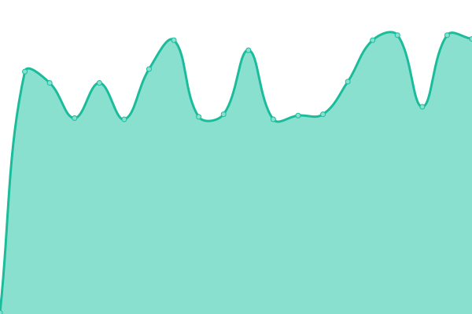

# [📈 Live Status](https://demo.upptime.js.org): <!--live status--> **🟧 Partial outage**

This repository contains the open-source uptime monitor and status page for [Upptime](https://upptime.js.org), powered by [Upptime](https://github.com/upptime/upptime).

With [Upptime](https://upptime.js.org), you can get your own unlimited and free uptime monitor and status page, powered entirely by a GitHub repository. We use [Issues](https://github.com/upptime/upptime/issues) as incident reports, [Actions](https://github.com/txyyddss/upptime/actions) as uptime monitors, and [Pages](https://demo.upptime.js.org) for the status page.

<!--start: status pages-->
<!-- This summary is generated by Upptime (https://github.com/upptime/upptime) -->
<!-- Do not edit this manually, your changes will be overwritten -->
<!-- prettier-ignore -->
| URL | Status | History | Response Time | Uptime |
| --- | ------ | ------- | ------------- | ------ |
|  [TX Service Index](https://1919801.xyz) | 🟥 Down | [tx-service-index.yml](https://github.com/txyyddss/upptime/commits/HEAD/history/tx-service-index.yml) | 

 168ms
     
 | 

<a href="https://status.1919801.xyz/history/tx-service-index">89.28%</a>
    

|  [Webmap(CF+IPV6)](https://map.1919801.xyz/maps/world/live/players.json) | 🟩 Up | [webmap-cf-ipv-6.yml](https://github.com/txyyddss/upptime/commits/HEAD/history/webmap-cf-ipv-6.yml) | 

 2122ms
     
 | 

<a href="https://status.1919801.xyz/history/webmap-cf-ipv-6">100.00%</a>
    

|  [Webmap(ZT)](http://114.114.51.4:8123/maps/world/live/players.json) | 🟥 Down | [webmap-zt.yml](https://github.com/txyyddss/upptime/commits/HEAD/history/webmap-zt.yml) | 

 2081ms
     
 | 

<a href="https://status.1919801.xyz/history/webmap-zt">54.77%</a>
    

|  [Game Server(ZT)](114.114.51.4) | 🟩 Up | [game-server-zt.yml](https://github.com/txyyddss/upptime/commits/HEAD/history/game-server-zt.yml) | 

 255ms
     
 | 

<a href="https://status.1919801.xyz/history/game-server-zt">61.26%</a>
    

|  [IPV6 Update(DDNSGO)](114.114.51.4) | 🟥 Down | [ipv-6-update-ddnsgo.yml](https://github.com/txyyddss/upptime/commits/HEAD/history/ipv-6-update-ddnsgo.yml) | 

 286ms
     
 | 

<a href="https://status.1919801.xyz/history/ipv-6-update-ddnsgo">63.87%</a>
    

|  [IPV4(MT)](https://proxyv6mc.1919801.xyz/mt) | 🟩 Up | [ipv-4-mt.yml](https://github.com/txyyddss/upptime/commits/HEAD/history/ipv-4-mt.yml) | 

 2394ms
     
 | 

<a href="https://status.1919801.xyz/history/ipv-4-mt">99.85%</a>
    

|  [IPV4(TX)](https://proxymy.1919801.xyz) | 🟩 Up | [ipv-4-tx.yml](https://github.com/txyyddss/upptime/commits/HEAD/history/ipv-4-tx.yml) | 

 7988ms
     
 | 

<a href="https://status.1919801.xyz/history/ipv-4-tx">100.00%</a>
    

|  [VPS(AWS HK)](awshk.1919801.xyz) | 🟩 Up | [vps-aws-hk.yml](https://github.com/txyyddss/upptime/commits/HEAD/history/vps-aws-hk.yml) | 

 197ms
     
 | 

<a href="https://status.1919801.xyz/history/vps-aws-hk">91.82%</a>
    

|  [VPS(Bytevirt HK)](bvhk.1919801.xyz) | 🟩 Up | [vps-bytevirt-hk.yml](https://github.com/txyyddss/upptime/commits/HEAD/history/vps-bytevirt-hk.yml) | 

 182ms
     
 | 

<a href="https://status.1919801.xyz/history/vps-bytevirt-hk">98.61%</a>
    

|  [VPS(Azure SG)](azsg.1919801.xyz) | 🟩 Up | [vps-azure-sg.yml](https://github.com/txyyddss/upptime/commits/HEAD/history/vps-azure-sg.yml) | 

 233ms
     
 | 

<a href="https://status.1919801.xyz/history/vps-azure-sg">100.00%</a>
    

<!--end: status pages-->

[**Visit our status website →**](https://status.1919801.xyz/)

## 📄 License

- Powered by: [Upptime](https://github.com/upptime/upptime)
- Code: [MIT](./LICENSE) © [Anand Chowdhary](https://anandchowdhary.com), supported by [Pabio](https://pabio.com)
- Data in the `./history` directory: [Open Database License](https://opendatacommons.org/licenses/odbl/1-0/)
